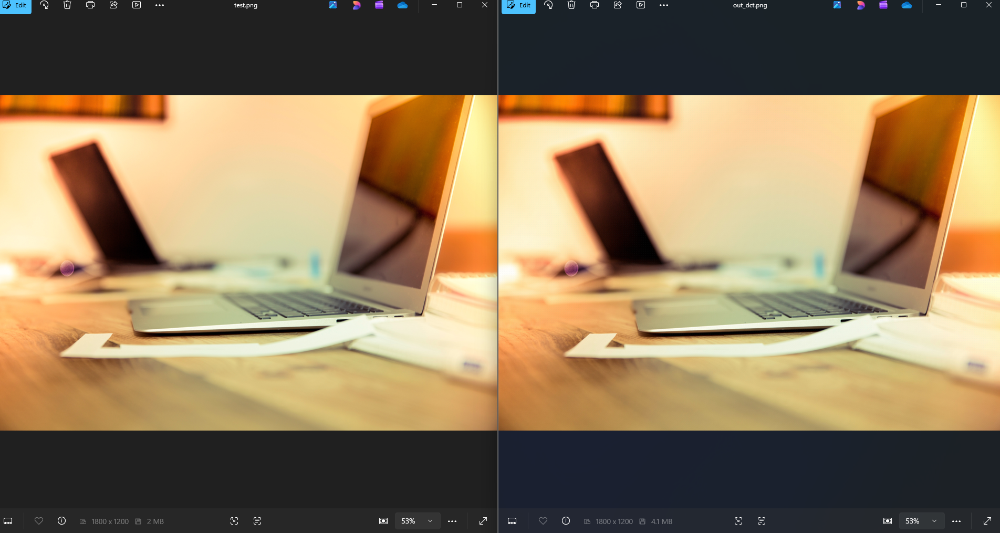

# ImageEcho 🔍

> Adversarial Machine Learning through invisible pixel perturbation.  
> A professional-grade C++ application demonstrating the **Strategy Pattern**, **RAII memory management**, and real **frequency-domain image processing**.

---

## What is ImageEcho?

ImageEcho is a C++ tool that applies **adversarial perturbations** to images — mathematically altering pixel data in ways that are **completely invisible to the human eye**, but designed to confuse machine learning classifiers.

The two images below are perceptually identical. The right one has had **4.7 million pixels altered**:



| Original | Perturbed (DCT Engine) |
|---|---|
| SSIM: 1.000 | SSIM: 0.996 |
| No changes | 4,751,626 pixels altered |

> SSIM (Structural Similarity Index) measures perceptual similarity. Values above 0.95 are considered imperceptible to humans.

---

## Engine Benchmark

All engines tested on a 1800×1200 RGB image at epsilon = 8/255:

| Engine | SSIM   | PSNR    | Mean Δ | Max Δ | Method |
|--------|--------|---------|--------|-------|--------|
| LSB    | 0.9992 | 41.0 dB | 2.03   | 3.0   | Bit flipping |
| DCT    | 0.9961 | 33.9 dB | 3.86   | 20.0  | Frequency domain |
| FGSM   | 0.9903 | 29.9 dB | 7.58   | 9.0   | Gradient sign |
| PGD    | 0.9958 | 33.5 dB | 4.16   | 9.0   | Iterative gradient |

All 4 engines maintain **SSIM > 0.99** — well above the 0.95 invisibility threshold.

---

## Architecture

ImageEcho uses the **Strategy Pattern** to keep engines completely interchangeable:

```
IEchoEngine (interface)
    │
    ├── LsbEngine    — flips least significant bits (simplest)
    ├── DctEngine    — injects noise into DCT high-frequency coefficients
    ├── FgsmEngine   — single-step Sobel gradient sign perturbation
    └── PgdEngine    — iterative multi-step gradient perturbation
```

Swapping engines requires **one line of code**:

```cpp
// Use any engine — zero other code changes needed
EchoContext ctx(std::make_unique<LsbEngine>());   // or DctEngine, FgsmEngine, PgdEngine
auto report = ctx.run(original, target);
```

The `runOptimal()` method automatically finds the highest perturbation that keeps SSIM above your target:

```cpp
// Binary search: finds best epsilon in 16 iterations
auto report = ctx.runOptimal(original, target, 0.95f);
```

---

## C++ Design Patterns Used

| Pattern | Where | Why |
|---|---|---|
| **Strategy** | `IEchoEngine` + `EchoContext` | Swap algorithms at runtime |
| **RAII** | `ImageBuffer` | Memory safe, no manual delete |
| **Factory** | `make_unique<Engine>()` | Clean engine construction |
| **Value Object** | `PerturbationReport` | Immutable result container |

---

## Project Structure

```
ImageEcho/
├── include/
│   ├── ImageBuffer.hpp        ← RAII pixel data owner
│   ├── ImageIO.hpp            ← PNG load/save (stb_image)
│   ├── IEchoEngine.hpp        ← Strategy interface
│   ├── EchoContext.hpp        ← Strategy context + optimal search
│   ├── SsimAnalyzer.hpp       ← SSIM + PSNR metrics
│   ├── PerturbationReport.hpp ← Result value object
│   └── engines/
│       ├── LsbEngine.hpp
│       ├── DctEngine.hpp
│       ├── FgsmEngine.hpp
│       └── PgdEngine.hpp
├── src/
│   └── main.cpp
├── third_party/
│   ├── stb_image.h
│   └── stb_image_write.h
└── assets/
    └── test.png
```

---

## Build Instructions (Windows)

### Prerequisites
- [MinGW-w64](https://www.msys2.org/) (GCC 15+)
- [CMake](https://cmake.org/) 3.16+
- [Ninja](https://ninja-build.org/)

### Build

```bash
git clone https://github.com/faraz334/ImageEcho.git
cd ImageEcho
cmake -B build -G "Ninja"
cmake --build build
```

### Run

Place any PNG image at `assets/test.png`, then:

```bash
.\build\ImageEcho.exe
```

---

## Key Concepts

**Adversarial Perturbation** — Small, carefully crafted changes to image pixels that fool ML models while remaining invisible to humans.

**SSIM** — Structural Similarity Index. Measures perceptual image quality from 0 (completely different) to 1 (identical). Values > 0.95 are imperceptible.

**DCT (Discrete Cosine Transform)** — Converts an 8×8 pixel block into frequency coefficients. ImageEcho injects perturbation into high-frequency coefficients (invisible to humans, disruptive to CNNs).

**FGSM** — Fast Gradient Sign Method. Approximates the gradient of a classifier's loss function using Sobel edge detection, then perturbs pixels in that direction.

**PGD** — Projected Gradient Descent. Multi-step FGSM that iteratively refines the perturbation while staying within an L∞ epsilon-ball.

---

## Built With

- C++17
- [stb_image](https://github.com/nothings/stb) — header-only PNG I/O
- CMake + Ninja

---

*Built as a university OOP project exploring Adversarial Machine Learning.*  
*Demonstrates: Strategy Pattern · RAII · Modern C++17 · Image Processing · ML Concepts*